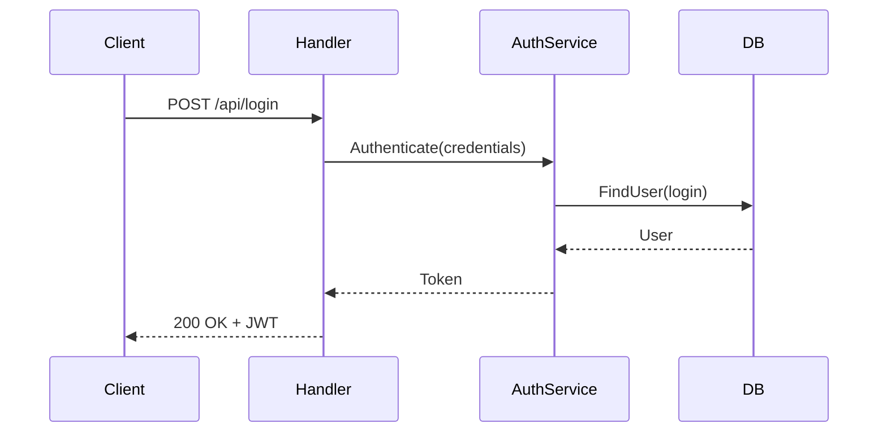

# Architecture Review

## Summary
Clean separation of concerns. The new handler follows existing patterns.

## Diagram

```mermaid
sequenceDiagram
    Client->>Handler: POST /api/login
    Handler->>AuthService: Authenticate(credentials)
    AuthService->>DB: FindUser(login)
    DB-->>AuthService: User
    AuthService-->>Handler: Token
    Handler-->>Client: 200 OK + JWT
```
